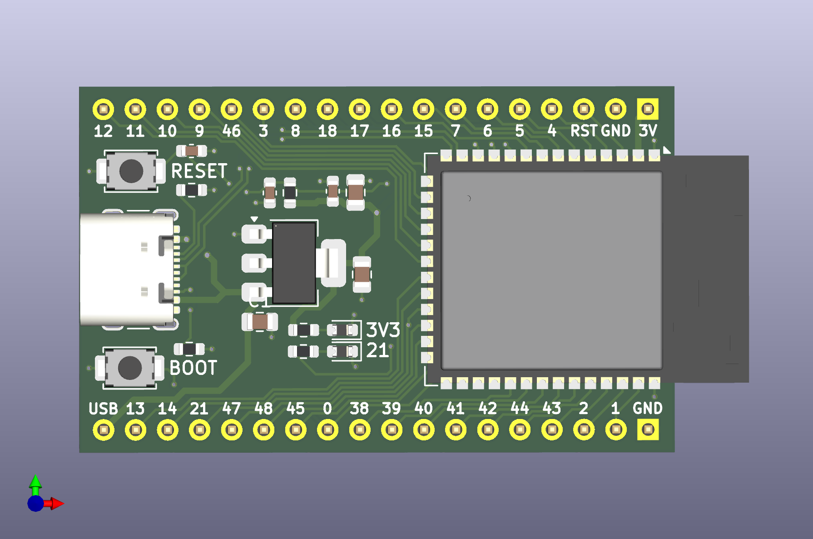
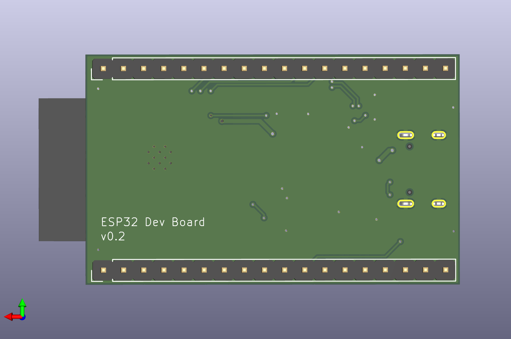

# esp32-dev-board
This repository contains the KiCad project files for a custom development board based on the ESP32-S3-WROOM module.

The board features a simplistic design, breaking out GPIO and power pins for easy prototyping, while using only essential components for power and data transfer. 

KiCad project files include the schematic and PCB designs which can be viewed and edited, and a full BOM with LCSC part numbers for sourcing and assembly. 

<p align="center">
  
</p>
<p align="center">
  
</p>

## Features

* **Core:** ESP32-S3-WROOM-1N8R8 module (8MB Flash + 8MB PSRAM).
* **USB Interface:** USB-C connector utilizing the S3's native USB Serial/JTAG controller.
* **Power:** Integrated 3.3V LDO regulator with a dedicated power LED indicator.
* **Prototyping:** Standard 2.54mm pitch header pins for full GPIO and power breakout.
* **Control:** Physical Reset and Boot buttons for manual flashing mode entry.
* **User IO:** Onboard programmable LED tied to **GPIO 21**.
* **Manufacturing:** Complete BOM included with **LCSC part numbers** for simplified sourcing and assembly.

## Arduino IDE Setup

To program the **ESP32-S3 Dev Board**, follow these steps to configure your environment.

### 1. Install the ESP32 Board Package
1. Open the Arduino IDE (v2.3.6 or newer recommended).
2. Go to **File > Preferences**.
3. In the **Additional Boards Manager URLs** field, paste the following link:
   `https://espressif.github.io/arduino-esp32/package_esp32_index.json`
4. Go to **Tools > Board > Boards Manager**, search for **esp32**, and install the latest version by **Espressif Systems**.

### 2. Required Board Settings
Because this board uses the **N8R8** module with native USB, you must use the following settings in the **Tools** menu:

| Setting            | Selection                          | Reason                                         |
|--------------------|------------------------------------|------------------------------------------------|
| **Board** | **ESP32S3 Dev Module** | Standard target for S3-WROOM modules.         |
| **USB CDC On Boot**| **Enabled** | **Critical:** Allows Serial Monitor over USB. |
| **Flash Mode** | **QIO 80MHz** | Standard for WROOM modules.                    |
| **Flash Size** | **8MB (64Mb)** | Matches the N8 (8MB Flash) specification.      |
| **PSRAM** | **OPI PSRAM** | Matches the R8 (8MB Octal) specification.     |


---

## Hardware Test Sketch

Use this sketch to verify that your PCB is fully functional. It tests the serial communication, identifies the onboard memory, and blinks the onboard LED on **GPIO 21**.

```cpp
/*
 * ESP32-S3 Dev Board Hardware Test
 * Verifies: Native USB Serial, GPIO 21 (LED), and N8R8 Memory
 */

const int USER_LED = 21;

void setup() {
  // Initialize Serial
  // Note: Since USB CDC is native, Serial.begin baud rate is ignored but kept for compatibility
  Serial.begin(115200);
  
  // Set LED pin as output
  pinMode(USER_LED, OUTPUT);

  // Wait 2 seconds so you don't miss the initial serial print
  delay(2000); 

  Serial.println("\n========================================");
  Serial.println("   ESP32-S3 CUSTOM DEV BOARD TEST");
  Serial.println("========================================");

  // Print Flash Size
  uint32_t flashSize = ESP.getFlashChipSize() / (1024 * 1024);
  Serial.printf("Flash Size: %d MB\n", flashSize);

  // Print PSRAM Size
  // If this shows 0MB, ensure 'Tools > PSRAM' is set to 'OPI PSRAM'
  uint32_t psramSize = ESP.getPsramSize() / (1024 * 1024);
  Serial.printf("PSRAM Size: %d MB\n", psramSize);

  if (psramSize > 0) {
    Serial.println("Status: PSRAM detected successfully!");
  } else {
    Serial.println("Status: PSRAM NOT FOUND. Check IDE settings.");
  }
  
  Serial.println("----------------------------------------");
  Serial.println("Beginning LED blink on GPIO 21...");
}

void loop() {
  // Toggle LED and print status
  digitalWrite(USER_LED, HIGH);
  Serial.println("LED: ON");
  delay(1000);

  digitalWrite(USER_LED, LOW);
  Serial.println("LED: OFF");
  delay(1000);
}
```

## Troubleshooting 

* **Failed to Connect:** If the IDE cannot find the board, hold the BOOT button, tap the RESET button, and then release BOOT to force the chip into "Download Mode."